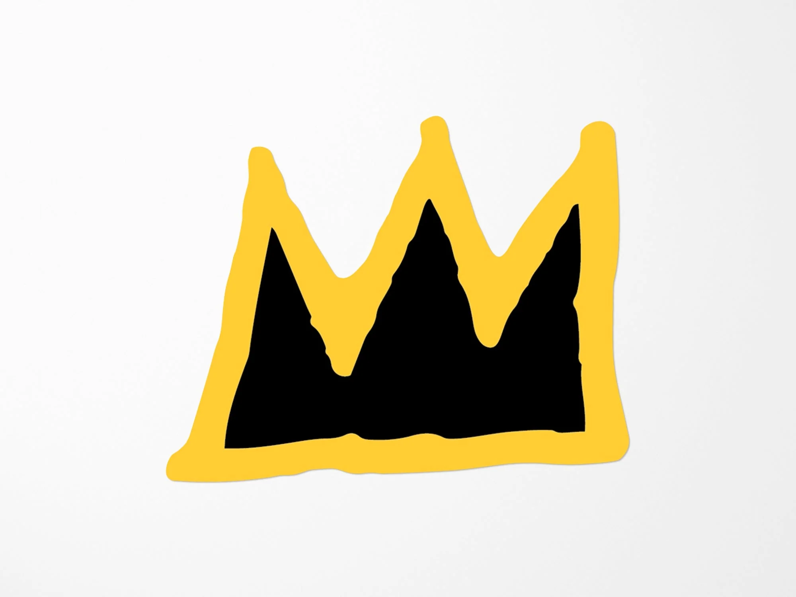

# Basquiat

<div align="center">
  
  
  <br />
  
  <h3>An AI agent to brainstorm, build, and modify your design file.</h3>
  <p>Open source. Local. Free (as in freedom).</p>

  <a href="https://www.figma.com/community/plugin/1589249271423490087/basquiat">
    
  </a>
  <a href="#license">
    
  </a>
  <!-- <a href="https://twitter.com/YOUR_HANDLE">
    
  </a> -->
</div>

---

## 🎨 What is Basquiat?

**Basquiat is an autonomous design agent that lives inside your Figma file.** Unlike standard AI chatbots that just give you text, Basquiat has "hands." It interfaces directly with the Figma Plugin API to create, modify, and refactor layers on your canvas. 

It is designed with a **Privacy-First** architecture. Basquiat has no backend server. It runs entirely on your local machine (client-side), connecting directly from your browser to your chosen LLM provider (Google Gemini or Anthropic Claude).

### Core Philosophy
* **Agentic:** It doesn't just describe designs; it builds them.
* **Local-First:** No accounts, no logins, no remote databases.
* **Transparent:** You bring your own API keys. You see the code.

---

## ✨ Features

* **🧠 Brainstorm & Build:** Ask Basquiat to generate UI components, wireframes, or entire layout sections from scratch.
* **👀 Context-Aware Vision:** Select any frame on your canvas. Basquiat "sees" the layer structure and properties to provide context-relevant edits.
* **🛠️ Direct Manipulation:** Can modify Frame attributes, Auto-Layout settings, Colors, Typography, and layer hierarchy.
* **💾 Persistent Memory:** Chat sessions are stored locally on your machine. You can close Figma and resume your design session later.
* **⚡ High Velocity:** Options to manually approve every change (for precision) or auto-approve (for speed).
* **🔓 Model Agnostic:** Switch instantly between **Google Gemini** and **Anthropic Claude** models using your own API keys.

---

## 🔒 Privacy & Security

We built Basquiat because we were tired of AI tools that required uploading our IP to opaque third-party servers.

* **No Backend:** This plugin has no intermediate server.
* **Key Storage:** Your API keys are stored in `figma.clientStorage` on your local device. They are never sent to us.
* **Data Flow:** Data flows directly: `Figma Client` -> `LLM Provider (Google/Anthropic)`.
* **Open Source:** You are reading the source code right now. Verify it yourself.

---

## 🚀 Getting Started

### Method 1: Install from Figma Community (Recommended)
The easiest way to use Basquiat is to install it directly from the Figma Community.
[**👉 Install Basquiat Plugin**](https://www.figma.com/community/plugin/1589249271423490087/basquiat)

### Method 2: Run Locally (For Developers)

If you want to contribute or audit the code, you can run it locally.

1.  **Clone the repository**
    ```bash
    git clone [https://github.com/ovjectibity/basquiat.git](https://github.com/ovjectibity/basquiat.git)
    cd basquiat
    ```

2.  **Install dependencies**
    ```bash
    npm install
    ```

3.  **Build the plugin**
    ```bash
    npm run build
    ```

4.  **Load in Figma**
    * Open Figma Desktop App.
    * Go to `Plugins` > `Development` > `Import plugin from manifest...`
    * Select the `manifest.json` file in this repository.

---

## 📖 Usage Guide

1.  **Set up your Brain:**
    * Open Basquiat.
    * Click the Settings (gear) icon.
    * Enter your **Google Gemini API Key** or **Anthropic API Key**.
    
2.  **The "Creation" Workflow:**
    * Ensure nothing is selected.
    * *Prompt:* "Create a dark mode pricing component with 3 cards: Basic, Pro, and Enterprise. Highlight the Pro card."
    
3.  **The "Refactor" Workflow (Context Awareness):**
    * Select a messy frame on your canvas.
    * *Prompt:* "Fix the spacing in this frame. Apply Auto-Layout with 16px padding and standardize the fonts."

---

## 🛠️ Tech Stack

* **Frontend:** React, TypeScript, TailwindCSS
* **Build Tool:** Vite
* **AI Integration:** Vercel AI SDK / Google Generative AI SDK / Anthropic SDK
* **Figma API:** Figma Plugin API

---

## 🤝 Contributing

Contributions are welcome! We want to make this the best open-source design agent in the world.

1.  Create your Feature Branch (`git checkout -b feature/AmazingFeature`)
2.  Commit your Changes (`git commit -m 'Add some AmazingFeature'`)
3.  Push to the Branch (`git push origin feature/AmazingFeature`)
4.  Open a Pull Request

---

## 📄 License

Distributed under the GNU GPL 3.0 License. See `LICENSE` for more information.

---

<!-- <div align="center">
  <p><i>Built with ❤️ by designers, for designers.</i></p>
</div> -->